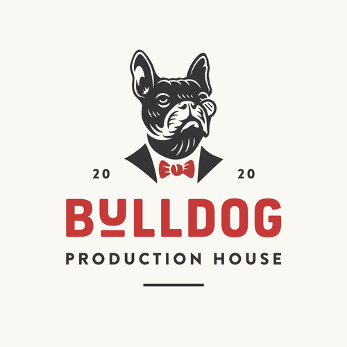

# Bulldog Production House

View the live project <a href="https://daidoo91.github.io/Bulldog-Production-House/index.html" target="_blank">here</a>

## Table Content

* [General Info](#general-info)
* [Technologies](#technologies)
* [Language](#language-used)
* [Features](#features)
* [Source](#source)
* [User Expirience](#user-expirience)
* [Testing](#testing)
* [Deployment](#deployment)

## User Experience (UX)

-   ### User stories

    -   #### First Time Visitor Goals

        1. As a First Time Visitor, I want to easily understand the main purpose of the site and learn more about the organisation.
        2. As a First Time Visitor, I want to be able to easily navigate throughout the site to find content.
        3. As a First Time Visitor, I want to look for testimonials to understand what their users think of them and see if they are trusted. I also want to locate their social media links to see their followings on social media to determine how trusted and known they are.
-   #### Returning Visitor Goals
       - 1. As a Returning Visitor, I want to find the best way to get in contact with the organisation with any questions I may have.
    -  2. As a Returning Visitor, I want to find community links.

    -   #### Frequent User Goals
        1. As a Frequent User, I want to check to see if there are any newly added litter of puppies.
        2. As a Frequent User, I want to check to see if there are any new updates of a incoming litters.
        3. As a Frequent User, I want to sign up to the Waiting list so that I am emailed any new arrivals.
-   ### Design
    -   #### Typography
        -   The Lato font is the main font used throughout the whole website with Sans Serif as the fallback font in case for any reason the font isn't being imported into the site correctly. Lato is a clean font used frequently in programming, so it is both attractive and appropriate.
    -   #### Imagery
        -   Imagery is important. The background hero image is designed to be striking and catch the user's attention. It also has a modern, energetic aesthetic.
        
- ## Testing User Stories from User Experience (UX) Section

   - #### First Time Visitor Goals

    1. As a First Time Visitor, I want to easily understand the main purpose of the site and learn more about the organisation.

        1. Upon entering the site, users are automatically greeted with a clean and easily readable navigation bar to go to the page of their choice. Underneath there is a Hero Image with Text
        2. The main points are made immediately with the hero image
        3. The user has three options, Home , Gallery and Signup. At the middle of the page there is more navigation links to the above options and at the bottom of the page they can find the social media links.

    2. As a First Time Visitor, I want to be able to easily be able to navigate throughout the site to find content.

        1. The site has been designed to be fluid and never to entrap the user. At the top of each page there is a clean navigation bar, each link describes what the page they will end up at clearly.
        2. At the bottom of the 3 pages there is a social media links
        3. On the Signup page , after a form response is submitted, the page refreshes and the user is brought to the top of the page where the navigation bar is.

    3. As a First Time Visitor, I want to look for testimonials to understand what their users think of them and see if they are trusted. I also want to locate their social media links to see their following on social media to determine how trusted and known they are.
        1. Once the new visitor has read the What We Do and Where We Are text, they will notice the location map , bellow that there is the social media links.
        2. The user can also scroll to the bottom of any page on the site to locate social media links in the footer.

-   #### Returning Visitor Goals

    1. As a Returning Visitor, I want to find the best way to get in contact with the organisation with any questions I may have.

        1. Here they can fill out the form on the Signup page or are told that alternatively they can message the organisation on social media.
        3. The footer contains links to the organisations Facebook, Twitter and Instagram page as well as the YouTube page
        4. Whichever link they click, it will be open up in a new tab to ensure the user can easily get back to the website.

    3. As a Returning Visitor, I want to find the Facebook Group link so that I can join and interact with others in the community.
        1. The Facebook Page can be found at the footer of every page and will open a new tab for the user and more information can be found on the Facebook page.
        2. Alternatively, the user can scroll to the bottom of the Home page to find the Facebook Group button which like any external link, will open in a new tab to ensure they can get back to the website easily.

-   #### Frequent User Goals

     1. As a Frequent User, I want to check to see if there are any new updates of a incoming litters.

        1. The user would already be comfortable with the website layout and can easily click the social media links

    3. As a Frequent User, I want to sign up to the Waiting list so that I am emailed any new arrivals.
        1. At the bottom of every page their is a footer which content is about the social media.
        2. To the top right of the page the user can easily see the Signup page.
        3. There is a "Join waiting list" button to the right hand side of the input field which is located close to the field and can easily be distinguished.

## General Info

This is website for Bulldog Production House. It is designed to be responsibe and accessible on a range of devices, making it easy to navigate for potential dog owners and partners.

## Features

* Responsive on all device sizes

## Language used
* HTML5
* CSS3

## Technologies

* Git : Git was used for version control by utilizing the Gitpod terminal to commit to Git and Push to GitHub.
* GitHub : GitHub is used to store the projects code after being pushed from Git.
* Balsamiq : Balsamiq was used to create the wireframes during the design process.
* Google Fonts : Google fonts were used to import the 'Titillium Web' font into the style.css file which is used on all pages throughout the project.
* Font Awesome : Font Awesome was used on all pages throughout the website to add icons for aesthetic and UX purposes.
* Testing : The W3C Markup Validator and W3C CSS Validator Services were used to validate every page of the project to ensure there were no syntax errors in the project.

## Testing

The W3C Markup Validator and W3C CSS Validator Services were used to validate every page of the project to ensure there were no syntax errors in the project.

-   [W3C Markup Validator](https://validator.w3.org/) - [Results-Home page](https://validator.w3.org/nu/?doc=https%3A%2F%2Fdaidoo91.github.io%2FBulldog-Production-House%2Findex.html) - [Results-Gallery page](https://validator.w3.org/nu/?doc=https%3A%2F%2Fdaidoo91.github.io%2FBulldog-Production-House%2Fgallery.html) - [Results-Signup page](https://validator.w3.org/nu/?doc=https%3A%2F%2Fdaidoo91.github.io%2FBulldog-Production-House%2Fsignup.html)

 

-   [W3C CSS Validator](https://jigsaw.w3.org/css-validator/) - [Results-Home page](https://jigsaw.w3.org/css-validator/validator?uri=https%3A%2F%2Fdaidoo91.github.io%2FBulldog-Production-House%2Findex.html&profile=css3svg&usermedium=all&warning=1&vextwarning=&lang=en) - [Results-Gallery page](https://jigsaw.w3.org/css-validator/validator?uri=https%3A%2F%2Fdaidoo91.github.io%2FBulldog-Production-House%2Fgallery.html&profile=css3svg&usermedium=all&warning=1&vextwarning=&lang=en) - [Results-Signup page](https://jigsaw.w3.org/css-validator/validator?uri=https%3A%2F%2Fdaidoo91.github.io%2FBulldog-Production-House%2Fsignup.html&profile=css3svg&usermedium=all&warning=1&vextwarning=&lang=en)

### Further Testing

-   The Website was tested on Google Chrome, Microsoft Edge and Safari browsers.
-   The website was viewed on a variety of devices such as Desktop, Laptop, iPhone 7, iPhone 8 & iPhone 11 Pro.
-   A large amount of testing was done to ensure that all pages were linking correctly.
-   Friends and family members were asked to review the site and documentation to point out any bugs and/or user experience issues.

## Source

All images are taken from Google.com!

## Deployment

### GitHub Pages

The project was deployed to GitHub Pages using the following steps...

1. Log in to GitHub and locate the [GitHub Repository](https://github.com/daidoo91/Bulldog-Production-House)
2. At the top of the Repository (not top of page), locate the "Settings" Button on the menu.
3. Scroll down the Settings page until you locate the "GitHub Pages" Section.
4. Under "Source", click the dropdown called "None" and select "Master Branch".
5. The page will automatically refresh.
6. Scroll back down through the page to locate the now published site [link](https://daidoo91.github.io/Bulldog-Production-House/index.html) in the "GitHub Pages" section.

### Forking the GitHub Repository

By forking the GitHub Repository we make a copy of the original repository on our GitHub account to view and/or make changes without affecting the original repository by using the following steps...

1. Log in to GitHub and locate the [GitHub Repository](https://github.com/daidoo91/Bulldog-Production-House)
2. At the top of the Repository (not top of page) just above the "Settings" Button on the menu, locate the "Fork" Button.
3. You should now have a copy of the original repository in your GitHub account.

### Thank you for viewing my website!